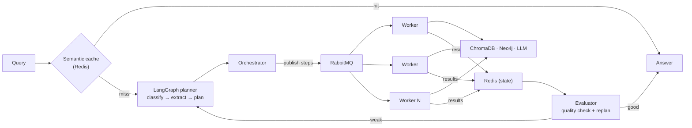

# Scalable Agentic RAG System with Distributed Worker Architecture

> An agentic Retrieval-Augmented Generation system that plans multi-step reasoning, executes it across a pool of stateless workers, and scales horizontally on Kubernetes.

<p align="left">
  
  
  
  
  
  
  
</p>

---

## What it does

Ask a complex question and the system doesn't just do a single vector lookup — it **plans**. A LangGraph planner classifies the query, extracts entities, and breaks it into steps. Those steps are dispatched over a message queue to a pool of interchangeable workers that run vector search (ChromaDB), graph traversal (Neo4j), and reasoning in parallel. Results are fused, evaluated, and — if the answer is weak — the system replans. Because the workers hold no state, you scale throughput by simply adding more of them.

## Why it's interesting

- **Agentic, multi-hop reasoning** — LangGraph plans and replans over the query instead of doing one-shot retrieval.
- **Stateless distributed workers** — horizontally scalable and fault-tolerant; any worker can pick up any step, and a crashed worker loses nothing.
- **Kubernetes-native scaling** — Horizontal Pod Autoscaling adds and removes workers based on queue depth and load.
- **Async task queue + semantic cache** — RabbitMQ decouples planning from execution; a Redis semantic cache short-circuits repeated queries.
- **Full-stack observability** — Prometheus + Grafana dashboards, with CI/CD on GitHub for automated tests and container builds.

## Performance

Measured under concurrent load:

| Metric | Result |
|---|---|
| End-to-end response latency | **↓ 35%** (RabbitMQ async queue + Redis semantic cache) |
| Cache hit rate | **~60%** |
| Worker scaling | Horizontal, queue-depth driven (Kubernetes HPA) |

## Architecture



The planner separates *deciding what to do* from *doing it*. Workers are stateless RabbitMQ consumers, so the execution tier scales independently of the API tier.

## Tech stack

| Layer | Tools |
|---|---|
| API | FastAPI (async), Python 3.10+ |
| Planning | LangGraph state machine |
| Retrieval | ChromaDB (vectors), Neo4j (graph), cross-encoder re-ranking |
| Messaging & state | RabbitMQ (async task queue), Redis (semantic cache + step results) |
| Orchestration | Docker Compose (local), Kubernetes + HPA (production) |
| Observability | Prometheus, Grafana, Loki |
| CI/CD | GitHub Actions — automated testing + container builds |

## Quick start

```bash
git clone https://github.com/Dhanashekar-k/Scalable-Agentic-RAG-System-with-Distributed-Worker-Architecture.git
cd Scalable-Agentic-RAG-System-with-Distributed-Worker-Architecture
cp docker/config/.env.example .env   # add your GROQ_API_KEY
cd docker && docker-compose up -d
```

Full setup, deployment options (Docker / Kubernetes / hybrid), verification, and troubleshooting are in **[GETTING_STARTED.md](./GETTING_STARTED.md)**.

## Documentation

| Doc | What's in it |
|---|---|
| [GETTING_STARTED.md](./GETTING_STARTED.md) | Setup, deployment, troubleshooting |
| [docs/AGENTIC_ARCHITECTURE.md](./docs/AGENTIC_ARCHITECTURE.md) | Planner, orchestrator, and worker design |
| [docs/DEPLOYMENT.md](./docs/DEPLOYMENT.md) | Kubernetes deployment guide |
| [docker/MONITORING.md](./docker/MONITORING.md) | Prometheus / Grafana / Loki setup |

## License

MIT — see [LICENSE](./LICENSE).
